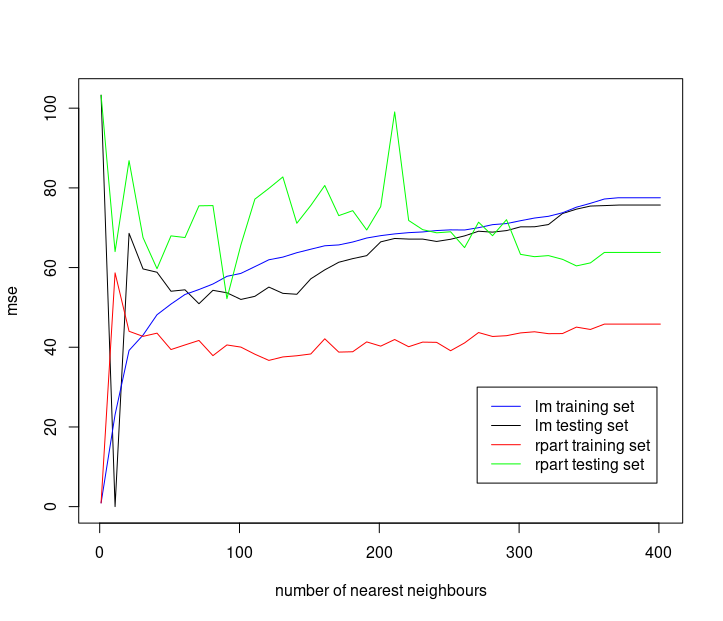
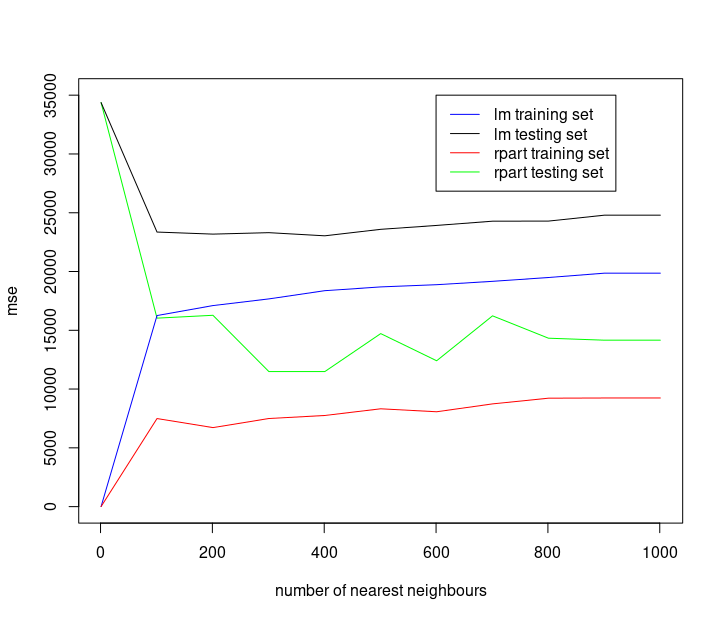

# Projekt

## Zagadnienie

___Temat:___ _Lokalna regresja (predykcja wartości funkcji docelowej dla przykładu za pomocą modelu jednorazowego użytku budowanego na podstawie jego „najbliższych sąsiadów”). Eksperymenty z kilkoma różnymialgorytmami do budowania modeli lokalnych. Porównanie z algorytmami regresji dostępnymi w R._

W ramach projektu należało napisać z użyciem pakietu R biblioteki/funkcji, która pozwoli na zastosowanie algorytmów regresji dostępnych w pakiecie R w trybie "lokalnym". Sprowadza się to do znalezienia w zbiorze danych (który musi być do tego odpowiednio przygotowany) zbioru trenującego dla danego przykładu z użyciem algorytmu k-najbliższych sąsiadów. Następnie dla takiego zbioru należy zastosować wybrany algorytm regresji z pakietu R. Jako algorytmy budowania modeli należy zastosować dostępne w pakiecie R algorytmy regresji. Wykorzystane algorytmy zostały opisane w dalszej części.

W ramach projektu miały zostać przeprowadzone testy sprawdzające działanie usyskanego kodu dla kilku algorytmów oraz zbiorów danych.

## Czemu warto zająć się takim zagadnieniem
Samo zadanie jest dość ciekawe ze względu na to, że istnieją sprawdzone algorytmy pozwalające na realizację regresji lokalnej takie jak _LOESS_ czy _LOWESS_. Jednym z powodów może być tutaj chęć przetestowania sprawności algorytmów regresji w trybie lokalnym i weryfikacji poprawności ich działania. Zastosowanie algorytmów budowanaia modeli regresji w trybie lokalnym pozwala na znaczne zmniejszenie czasu i zasobów potrzebnych do wykonania predykcji, co wynika ze znacznego ograniczenia liczebności danych trenujących do tylko tych z bezpośredniego obszaru (k-najbliższych sąsiadów). Zastosowanie modelu lokalnego pozwala także na obserwację zagadnień o nieliniowej chrakterystyce, jako, że w odpowiednio wąskim otoczeniu taka zależność będzie wykazywała właściwości liniowe (podobnie jak w szeregu Taylora).

## Zbiory danych
Do projektu musieliśmy wybrać zbiory danych testowych które powinny spełniać wymagania:
 - liczba atrybutów powinna być odpowiednio duża (>5 atrybutów)
 - zmienna objaśniana powinna być ciągła lub zachowywać sens w przypadku interpolacji (np. ocena filmu w skali dyskretnej 1-10 zachowuje sens dla wartości 9.81)
 - zbiór danych powinien zawierać odpowiednio dużo przykładów

Po długich poszukiwaniach sensownych i odpowiednio ciekawych danych do analizy na dostępnych portalach udostępniających zbiory danych (Kaggle, Data.World) zdecydowaliśmy się na trzy zbiory danych przedstawione poniżej.

### Zbiór danych wypożyceń rowerów w systemie wypożyczalni
Dane pochodzą ze strony: [https://data.world/data-society/capital-bikeshare-2011-2012]().

Zbiór zawiera 17379 przykładów dotyczących wypożyczeń rowerów w systemie wypożyczalni w Waszyngtonie. Dostępne są atrybuty związane z czasem wypożyczenia (dzień tygodnia, godzina), pogodą (temperatura, wilgotność, prędkość wiatru) oraz liczby wypożyczonych rowerów (użytkownicy zarejestrowani, użytkownicy niezarejestrowani, użytkownicy łącznie). W szczególności regresję można badać w zakresie łącznej liczby wypożyczeń. Zbiór wydaje się dość ciekawy do zbadania oraz jest wystarczająco duży.

```{r, tidy=TRUE, tidy.opts=list(width.cutoff=60)}
bikes <- read.csv("https://query.data.world/s/jcpgkqdal2ztirvoahx5dmopkpzr7q", header=TRUE, stringsAsFactors=FALSE)
bikes$Casual.Users <- NULL
bikes$Registered.Users <- NULL
bikes$Date <- NULL
```


### Zbiór danych używanych samochodów
Dane pochodzą ze strony: [https://www.kaggle.com/c/usedcarvaluation]()

Zbiór zawiera 70000 obserwacji (przykładów) dotyczących cen sprzedaży samochodów osobowych o określonej marce, wieku, pojemności silnika, mocy, przejechanej odległości oraz liczby poprzednich właścicieli. Wszystkie atrybuty poza marką są atrybutami ciągłymi (bądź dającymi się uciąglić). Atrybutem przywidywanym dla tego zbioru jest wartość samochodu.

```{r, tidy=TRUE, tidy.opts=list(width.cutoff=60)}
cars <- read.csv("cars.csv", header=TRUE, stringsAsFactors=FALSE)
cars$year <- NULL
```


### Zbiór danych nieruchomości
Dane pochodzą ze strony: [https://www.kaggle.com/quantbruce/real-estate-price-prediction]()

Zbiór zawiera 414 obserwacji dotyczących sprzedaży nieruchomości (domów i mieszkań) opisanych z użyciem daty transakcji, wieku nieruchomości, odległości od przystanku, liczby sklepów w okolicy, położenia geograficznego oraz ceny za jednostkę powierzchni. W przypadku tych danych będziemy przewidywać cenę za jednostkę powierzchni.

```{r, tidy=TRUE, tidy.opts=list(width.cutoff=60)}
real_estate <- read.csv("real_estate.csv", header=TRUE, stringsAsFactors=FALSE)
real_estate$No <- NULL
```

Jest to dość mały zbiór, jednak w zupełności wystarczy do przetestowania poprawności działania algorytmów.

=======
### Normalizacja i denormalizacja danych
W celu poprawnego zastosowania metody kNN (k najbliższych sąsiadów) do ogreślenia zbioru treningowego dane muszą być uprzednio znormalizowane. Jest to wymagane, ponieważ algorytm kNN bazuje na funkcji odległości. Brak normalizacji sprawiłby, że jeden z atrybutów byłby wyróżniony ze względu na większy zakres wartosci. Stosuje się trzy rodzaje normalizacji:
 - Min-Max - liniowe przeskalowanie wartości do przedziału $[0-1]$ dla atrybutów ograniczonych (o ustalonych wartościach minimalnej i maksymalnej)
 - Z-score - Przeskalowanie z użyciem rozkładu normalnego o średniej $E = 0$ i wariancji $\sigma^{2} = 1$. - dla wartości nieograniczonych: $x$
 - Przydzielenie wartości $[0-1]$ rozłożonych równomiernie dla atrybutów dyskretnych
 
W powstałym pakiecie taka normalizacja wykonywana jest automatycznie przy tworzeniu modelu lokalnej regresji oraz przy używaniu metod pozwalających na wykonanie jokalnej regresji.

## Implementacja

### Realizacja pakietu R
Proponowane przez nas rozwiązanie dostarczone jest w postaci pakietu R o nazwie `mow.local.regression`. Pakiet udokumentowany jest z użyciem standardu dokumentacji pakietu R. Do dyspozycji użytkownika dostępne są następujące funkcje:
 - `createLocalRegressionModel` - tworzy model lokalnej regresji na podstawie danych trenujących oraz wskazanych sposobów normalizacji
 - `wrap` - pozwala na przeprowadzenie lokalnej regresji z użyciem wybranego algorytmu budowania modelu regresji
 - `localLinearWrap` - pozwala na przeprowadzenie lokalnej regresji z użyciem modelu `lm`
 - `regressionTreeWrap` - pozwala na przeprowadzenie lokalnej regresji z użyciem modelu `rpart` (drzewa regresji)
Pozostałe nieprywatne funkcje w pakiecie są używane jako funkcje pomocnicze przez wyróżnione powyżej funkcje. Pozostały one jako funkcje nieprywatne ze względu na ich potencjalną użyteczność w innych problemach. Do tych funkcji należą:
 - `normalizeDataFrame` - normalizuje `data.frame` z użyciem wskazanych metod normalizacji
 - `normalizeEnumVector` - normalizuje tekstowy wektor enumeracyjny 
 - `normalizeVector` - normalizuje wektor na podstawie modelu regresji lokalnej
 - `splitDataFrame` - rozdziela `data.frame` na dwie `data.frame` (treningową i testową) we wskazanej proporcji
 - `stripDependentVariable` - usuwa z `data.frame` zmienną zależną w podanej formule
 
Pełną dokumentację wskazanych funkcji mozna uzyskać stosując polecenie `?functionName` w pakiecie R.

### Implementacja pakietu

Głownym celem projektowanego pakietu było stworzenie "wrappera" - narzędzia pozwalającego na użycie istniejacych funkcji budowania modelu regresji w kontekście regresji lokalnej.

Działanie pakietu oparte jest wokół klasy S4 `LocalRegressionModel`. Przechowuje ona model danych oraz informacje o normalizacji danych. Obiekt tej klasy może zostać stworzony przy użyciu funkcji `createLocalRegressionModel` z przekazaniem `data.frame` z danymi treningowymi oraz wektorem opisującym sposób normalizacji. Z użyciem utworzonego obiektu można następnie używać metody `wrap` która pozwala na wykonanie regresji lokalnej przy użyciu wskazanej funkcji budowania modelu regresji. 

Wewnętrze działanie funkcji `wrap` składa się z wykonania dla każdego rekordu w przekazanym `data.frame` danych testowych następujących kroków: 
1. Normalizacja przekazanego wektora z użyciem parametrów wskazanych w obiekcie `LocalRegressionModel`
2. Znalezienie najbliższych sąsiadów z użyciem algorytmu kNN (dla zadanego k)
3. Predykcja wartości z użyciem modelu wskazanego dla funkcji wrap

Dostępne są także specjalizowane implementacje funkcji `wrap`: `localLinearWrap` oraz `regressionTreeWrap` pozwalające na wykonanie regresji z modelami odpowiednio `lm` oraz `rpart`.

Typowy przepływ użycia pakietu składa się z następujących kroków:
1. Utworzenie modelu regresji liniowej z użyciem funkcji `createLocalRegressionModel`
2. Użycie funkcji `wrap` w celu wykonanania regresji lokalnej

Losowego podziału na partycje testową i treningową mozna dokonac za pomocą funkcji `splitDataFrame`.

Funkcja normalizująca dane zastosowana w pakiecie obsługuje dane numeryczne oraz tekstowe. Należy jednak zwrócić uwagę na to, że dane tekstowe zostaną automatycznie potraktowane jako dane enumerujące (atrybuty dyskretne) i zostaną odpowiednio zamienione na znormalizowane wartości liczbowe. Istnieje założenie o zupełności wartości w tej kolumnie (przy badaniu nie będą pojawiały się wartości inne niż któraś z tych w danych treningowych). W przypadku niezgodności algorytm wypisze ostrzeżenie oraz potraktuje znormalizowaną wartość jako $0$.

## Użycie pakietu
przykładowy kod uzywający zaproponowany pakiet przedstawiono poniżej:
```{r, tidy=TRUE, tidy.opts=list(width.cutoff=60)}
library('mow.local.regression')
library('rpart')
real_estate <- read.csv("real_estate.csv", header=TRUE, stringsAsFactors=FALSE)
real_estate$No <- NULL
rs_model <- createLocalRegressionModel(real_estate, list("zscore","zscore","zscore","zscore","zscore","zscore","omit"))
print(c("Expected value: ", real_estate[1,]$house.price.of.unit.area),quote = FALSE)
print(c("For n=1:        ", wrap(rs_model, real_estate[1,], 1,   "cover_tree", rpart, house.price.of.unit.area ~ house.age, method="anova")[[1]]), quote = FALSE)
print(c("For n=10:       ", wrap(rs_model, real_estate[1,], 10,  "cover_tree", rpart, house.price.of.unit.area ~ house.age, method="anova")[[1]]), quote = FALSE)
print(c("For n=100:      ", wrap(rs_model, real_estate[1,], 100, "cover_tree", rpart, house.price.of.unit.area ~ house.age, method="anova")[[1]]), quote = FALSE)
```

## Metody regresji lokalnej z pakietu R
### LOESS
LOESS (_locally estimated scatterplot smoothing_) jest algorytmem pozwalającym na uzyskanie regresji lokalnej z użyciem wielomianów oraz metody kNN. Jego działanie opiera się na znalezieniu odpowiedniego otoczenia badanego punktu przy pomocy algorytmu kNN z użyciem metryki ważonej. Następnie przy użyciu znalezionego otoczenia wyznaczana jest wielomianowe dopasowanie funkcji do znalezionych punktów. Z dopasowaniej funkcji znajdowana jest oczekiwana wartość dla wektora dla którego poszukujemy przewidywanej wartości. Jest to gotowy algorytm pozwalający na regresję lokalną. Stosowany jest często do wygładzania wykresów oraz wygładzania sygnałów w zagadnieniach DSP (pod nazwą: filtr Savitzky–Golay'a). 

Implementacja LOESS znajdująca się w bibliotece standardowej pakietu R pozwala na predykcję zależności z maksymalnie czterema zmiennymi zależnymi. Jest to znaczne ogranicznenie w przypadku wybranych przez nas zbiorów danych. Jednocześnie natrafiliśmy na problemy
z niektórymi kolumnami. Użycie ich w formule sprawiało, że model nie był w stanie poprawnie dokonać predykcji na zbiorze testowym
i zwracał wartości `NA`. W związku z powyższymi zdecydowaliśmy się nie używać wbudowanej funkcji `loess` do porównania.

### Metody rpart i lm

Wbudowane metody `lm` i `rpart` przygotowują model za pomocą, kolejno, regresji liniowej i drzew regresji.
W ramach projektu porównaliśmy wyniki działania tych funkcji z ich "opakowanymi" odpowiednikami 
zapewnionymi przez nasz pakiet.

## Wyniki i porównanie z metodami regresji lokalnej dostępnymi w pakiecie R

Do wygenerowania wykresów użyty został kod podobny do zapisanego poniżej.

```{r eval=FALSE, tidy=TRUE, tidy.opts=list(width.cutoff=60)}
data <- splitDataFrame(real_estate, 0.9)
rs_model <- createLocalRegressionModel(data$train, list("zscore","zscore","zscore","zscore","zscore","zscore","omit"))
ns <- seq(1, 401, by=100)
errs <- sapply(ns, function(x) {
  print(x)
  markClassifier(rs_model, data$test, regressionTreeWrap, x, house.price.of.unit.area ~ .)$testError
})
plot(ns, errs[1,], xlab="#neighbours", ylab="mse", type="l")
```

Poniższe wykresy przedstawiają wartość średniego błędu kwadratowego, średniego błędu względnego oraz współczynnik determinacji
w zależności od przyjętego parametru `n` oznaczającą liczbę najbliższych sąsiadów dla budowania modelu lokalnego.

### Zbiór "Real Estate"

Dla zbioru "Real Estate" przyjęliśmy rozmiar łączny zbioru za 414 rekordów (pełny zbiór) z podziałem 0.9 pomiędzy dane treninowe a dane testowe.





Z histogramu widać, że większość kwadratów błędów mieści się na poziomie $10$ czyli sam błąd jest na poziomie $\pm 10^{0.5}$. Co jest dość sensownym oszacowaniem.


### Zbiór "Bikes"
Dla zbioru "bikes" przyjęliśmy rozmiar łączny zbioru za 1000 rekordów z podziałem 0.9 pomiędzy dane treninowe a dane testowe.





Z histogramu widać, że większość kwadratów błędów mieści się na poziomie $10^{2}$ czyli sam błąd jest na poziomie $\pm 10^{1}$. Jest to dość duży błąd oszacowania patrząc na wartości w zbiorze testowym.

Przypuszczamy, że duże wartości błędów MSE pochodzą z pojawienia się w danych testowych wektora znacznie oddalonego od pozostałych wartości. Spowodowało to wyznaczenie znacznie większej wartości od oczekiwanej, co przy podniesieniu do kwadratu dało bardzo duży udział w błędzie. Potencjaln

### Zbiór "Cars"

Dla zbioru "Cars" przyjeliśmy rozmiar łaczny zbioru za 1000 rekordów z podziałem 0.9 pomiędzy dane treninowe a dane testowe.


Z histogramu widać, że większość kwadratów błędów mieści się na poziomie $10^{6}$ czyli sam błąd jest na poziomie $\pm 10^{3}$. Jak na wartość samochodu błąd na poziomie $10^{3}$ wydaje się całkiem sensownym oszacowaniem.


Funkcje `lm` i `rpart` poradziły sobie następująco:

```{r table2, echo=FALSE, message=FALSE, warnings=FALSE, results='asis'}
tabl <- "
|           | lm estates | rpart estates | lm bikes | rpart bikes | lm cars   | rpart cars |
|-----------|------------|---------------|----------|-------------|-----------|------------|
| train mse | 77.52      | 45.81         | 20691.72 | 10505.44    | 36350873  | 698879842  |
| train mre | 0.26       | 0.13          | 0.51     | 0.56        | -0.21     | 0.83       |
| train cod | 0.26       | 0.67          | -------  | 0.47        | 0.79      | -0.86      |
| test mse  | 73.52      | 74.47         | 23001.75 | 14469.54    | 170134632 | 21159213   |
| test mre  | 0.19       | 0.17          | 0.50     | 0.54        | -0.53     | 0.47       |
| test cod  | 0.38       | 0.51          | -------- | 0.30        | 0.14      | 0.89       |
"
cat(tabl) # output the table in a format good for HTML/PDF/docx conversion
```


## Podsumowanie

Część implementacyjną projektu udało się przeprowadzić bez większych przeszkód (poza zmaganiami z nietypowymi zachowaniami R dla wektorów nazwanych). Część testowa została niestety mocno ograniczona przez wydajności komputerów na których dokonywaliśmy testów. Przy dużych zbiorach danych (>1000) dostawaliśmy błędy alokacji pamięci. Jest to jeden z powodów dla których nasze testy nie dały bardzo satysfakcjonujących rezultatów - zbiory danych były ciekawe do szukania w nich zależności i wykonania regresji, jednak dla tak małego podzbioru ciężko taką zależność znaleźć. Dodatkowo uzyskaliśmy znaczne błędy (w szczegółności MSE) które też z dużym prawdopodobieństwem pochodzą od zbyt małego zbioru danych treningowych. Jednak dla dostatecznie małych danych oraz wartościach o których możemy się domyślać co do zależności zaprojektowany algorytm sprawdza się całkiem dobrze.
